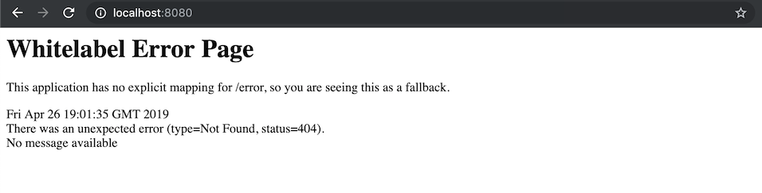

## Prerequisites

### Installed on your machine
- Maven 3.3.9+
- JDK version 1.8.0_51+
- Docker Desktop 2.0.0.3+
- IntelliJ (preferred) or other IDE with the JDK configured

## Verification of setup

1. Clone the following project.
```
git clone https://github.com/kwoding/contact-service-test.git
```

2. Verify you can run the test application by executing the following command:
```
docker run -p 8080:8080 kwoding/contact-service:latest
```

3. The logs (of Docker) should end with the following:
```
2019-05-26 18:59:48.057  INFO 1 --- [           main] o.s.b.w.embedded.tomcat.TomcatWebServer  : Tomcat started on port(s): 8080 (http) with context path ''
2019-05-26 18:59:48.059  INFO 1 --- [           main] it.ding.contact.ContactApplication       : Started ContactApplication in 7.749 seconds (JVM running for 8.632)
```

4. Navigate in your browser to http://localhost:8080, you should see the following on your screen.



5. Run the following command to ensure you have everything set up.

```
mvn clean test
```

Expected result is a successful build:
```
-------------------------------------------------------
 T E S T S
-------------------------------------------------------
Running it.ding.contact.CreateContactTest
Tests run: 1, Failures: 0, Errors: 0, Skipped: 0, Time elapsed: 0.279 sec

Results :

Tests run: 1, Failures: 0, Errors: 0, Skipped: 0

[INFO] ------------------------------------------------------------------------
[INFO] BUILD SUCCESS
[INFO] ------------------------------------------------------------------------
[INFO] Total time: 4.300 s
[INFO] Finished at: 2019-05-26T13:46:45-05:00
[INFO] Final Memory: 22M/225M
[INFO] ------------------------------------------------------------------------
```
